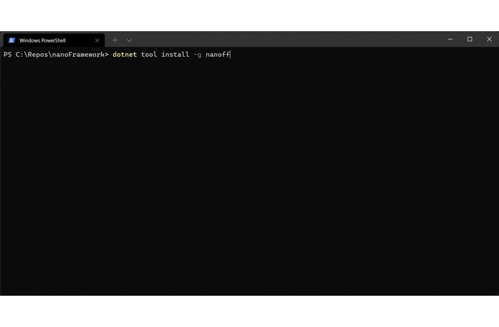
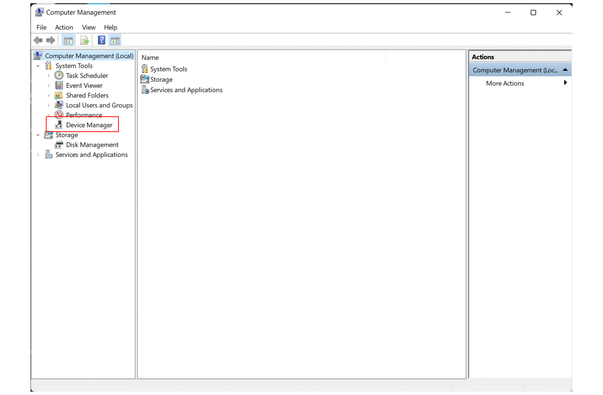

[](https://github.com/nanoframework/Home/blob/main/CONTRIBUTING.md) [](https://dev.azure.com/nanoframework/nanoFirmwareFlasher/_build/latest?definitionId=45&repoName=nanoframework%2FnanoFirmwareFlasher&branchName=main) [](https://www.nuget.org/packages/nanoff/) [](https://discord.gg/gCyBu8T)


-----
Document Language: [English](README.md) | [中文简体](README.zh-cn.md)

# Welcome to the .NET **nanoFramework** firmware flasher tool repository

This repo contains the **nano** **f**irmware **f**lasher tool.
It's a [.NET Core Tool](https://docs.microsoft.com/en-us/dotnet/core/tools/global-tools) that allows flashing a .NET **nanoFramework** target with a firmware image (nanoBooter and nanoCLR), the application deployment (all assemblies required to run a .NET application) and restore previously saved deployment images.
Is part of .NET **nanoFramework** toolbox, along with other various tools that are required in .NET **nanoFramework** development, usage or repository management.

It makes use of several 3rd party tools:

- Espressif esptool
   You can find the esptool and licensing information on the repository [here](http://github.com/espressif/esptool).
- STM32 Cube Programmer
   You can find the source, licensing information and documentation [here](https://www.st.com/en/development-tools/stm32cubeprog.html).
- Texas Instruments Uniflash
   You can find the Uniflash tool and licensing information [here](http://www.ti.com/tool/download/UNIFLASH).
- SEGGER J-Link
   You can find the J-Link, licensing information and documentation [here](https://www.segger.com/downloads/jlink/).

We are also distributing this tool as a .NET library so it can be integrated in 3rd party applications. Please check the [README](Samples\README.md) in the Samples folder for more details along with sample applications.

## Install .NET **nanoFramework** Firmware Flasher

Perform a one-time install of the .NET **nanoFramework** Firmware Flasher tool using the following .NET Core CLI command:

```console
dotnet tool install -g nanoff
```

After a successful installation a message is displayed showing the command that's to be used to call the tool along with the version installed. Similar to the following example:

```console
You can invoke the tool using the following command: nanoff
Tool 'nanoff' (version '9.9.9') was successfully installed.
```



### Install path issues

:warning: That are know issues running commands for STM32 devices when `nanoff` is installed in a path that contains diacritic characters. This is caused by a known bug in STM32 Cube Programmer. 
If that's the case with your user path, for example, you have to install it in a location that does have those.
To accomplish that, use the following .NET Core CLI command on which the path where the tool will be installed is specified:

```console
dotnet tool install nanoff --tool-path c:\a-plain-simple-path-to-install-the-tool
```

Note that if you're not using `nanoff` with STM32 devices, this limitation does not apply.

### MacOS users

You'll need to add `nanoff` to your path as well, once installed run:

```console
export PATH=$PATH:~/.dotnet/tools
```

## Update .NET **nanoFramework** Firmware Flasher

To update .NET **nanoFramework** Firmware Flasher tool use the following .NET Core CLI command:

```console
dotnet tool update -g nanoff
```

If the tool was installed at a specific path, use the following .NET Core CLI command instead:

```console
dotnet tool update nanoff --tool-path c:\path-where-the-tool-was-installed
```

## Usage

Once the tool is installed, you can call it by using its command `nanoff`, which is a short version of the name to ease typing.

```console
nanoff [command] [args]
```

The tool includes help for all available commands. You can see a list of all available ones by entering:

```console
nanoff --help
```

List of usage examples per platform:

- [ESP32](#esp32-usage-examples)
- [STM32](#stm32-usage-examples)
- [TI CC13x2](#ti-cc13x2-usage-examples)
- [Silabs Giant Gecko](#silabs-giant-gecko-usage-examples)
- [Common options](#common-options)

## ESP32 usage examples

There are multiple ESP32 images available, some are build specifically for a target. Please check out the [list](https://github.com/nanoframework/nf-interpreter#firmware-for-reference-boards). You will need as well to know the COM port used by your device. Find [how to do this here](#finding-the-device-com-port-on-windows). Alternatively, you can as well list the available COM ports. If you list them first without the device to flash and then plugging the device, the additional port which will show up is the one for the device to flash. This method works for all OS:

```console
nanoff --listports
```

The ESP32_PSRAM_REV0 image will just work for any variant of the ESP32 series, with or without PSRAM, and for all silicon revisions.
You can read more about the differences between the various images [here](https://docs.nanoframework.net/content/reference-targets/esp32.html).

The FEATHER_S2 image will just work for pretty much all variants of the ESP32-S2 series that expose the embedded USB CDC pins.
You can read more about the differences between the various images [here](https://docs.nanoframework.net/content/reference-targets/esp32.html).

When using `nanoff` you can add `--target MY_TARGET_NAME_HERE` to use a specific image. If, instead, you just specify the platform with `--platform esp32` `nanoff` will choose the most appropriate image depending on the features of the device that's connected. Output similar to this one will show to advise what's the image about to be used:

```console
No target name was provided! Using 'ESP32_REV0' based on the device characteristics.
```

>Note: Please note that for ESP32-S2 targets is not possible to safely determine what's the best image to use. For this reason it's mandatory providing the appropriate target name with `--target MY_TARGET_NAME_HERE`.

Some ESP32 boards have issues entering bootloader mode. This can be usually overcome by holding down the BOOT/FLASH button in the board.
In case `nanoff` detects this situation the following warning is shown:

```console
*** Hold down the BOOT/FLASH button in ESP32 board ***
```

:warning: To update FeatherS2 and TinyS2 the boards need to put in _download mode_ by holding [BOOT], clicking [RESET] and then releasing [BOOT].

### Update the firmware of an ESP32 target

To update the firmware of an ESP32 target connected to COM31, to the latest available development version.

```console
nanoff --update --target ESP32_PSRAM_REV0 --serialport COM31
```

### Update the firmware of an ESP32-S2 KALUGA 1 with a local CLR file

To update the firmware of an ESP32-S2 KALUGA 1 target connected to COM31 with a local CLR file (for example from a build).
This file has to be a binary file with a valid CLR from a build. No other checks or validations are performed on the file content.

```console
nanoff --update --target KALUGA_1 --serialport COM31 --clrfile "C:\nf-interpreter\build\nanoCLR.bin" 
```

You can adjust the name of the core image you want to use. Refer to the previous section to get the full list.

### Show details of the connected ESP32 device

To show the details of the ESP32 device connected to COM31.

```console
nanoff --platform esp32 --serialport COM31 --devicedetails 
```

### Deploy a managed application to an ESP32 target

To deploy a managed application to an ESP32_PSRAM_REV0 target connected to COM31.

>Note: The binary file with the deployment image can be found on the Release or Debug folder of a Visual Studio project after a successful build. This file contains everything that's required to deploy a managed application to a target (meaning application executable and all referenced libraries and assemblies).

```console
nanoff --target ESP32_PSRAM_REV0 --serialport COM12 --deploy --image "E:\GitHub\nf-Samples\samples\Blinky\Blinky\bin\Debug\Blinky.bin"
```

### Update the firmware of an ESP32 target along with a managed application

To deploy an application on an ESP32 target connected to COM31, with your application, you have to specify the path to the managed application. Optionally you can provide an address which will override the default deployment address.
This example uses the binary format file that you can find when you are building an application. Note, as only application can run, when you are building a library, a bin file is not created automatically. Only for applications.

```console
nanoff --target ESP32_PSRAM_REV0 --update --serialport COM31 --deploy --image "c:\eps32-backups\my_awesome_app.bin" --address 0x1B000
```

## STM32 usage examples

### Update the firmware of a specific STM32 target

To update the firmware of the ST_STM32F769I_DISCOVERY target to the latest available stable version using the JTAG connection.

```console
nanoff --update --target ST_STM32F769I_DISCOVERY --jtag
```

### Deploy a managed application to a ST_STM32F769I_DISCOVERY target

To deploy a managed application to a ST_STM32F769I_DISCOVERY target, which has the deployment region at 0x08080000 flash address and reset the MCU after flashing it.

>Note: The binary file with the deployment image can be found on the Release or Debug folder of a Visual Studio project after a successful build. This file contains everything that's required to deploy a managed application to a target (meaning application executable and all referenced libraries and assemblies).

```console
nanoff --target ST_STM32F769I_DISCOVERY --deploy --image "E:\GitHub\nf-Samples\samples\Blinky\Blinky\bin\Debug\Blinky.bin" --address 0x08040000 --reset
```

### Update the firmware of a ST_STM32F769I_DISCOVERY along with a managed application

To update the firmware of the ST_STM32F769I_DISCOVERY target to the latest available version, using a JTAG connection, along with a managed application.
You have to specify the path to the managed application.
This example uses the binary format file that is generated by Visual Studio when building any nanoFramework C# application. Because it's a binary file you have to specify too the flash address of the deployment region (here 0x08000000, mind the hexadecimal format).

```console
nanoff --update --target ST_STM32F769I_DISCOVERY --jtag --binfile "c:\dev\my awesome app\bin\debug\my_awesome_app.bin" --address 0x08000000
```

### List all STM32 devices available with JTAG connection

This useful to list all STM32 devices that are connected through JTAG.

```console
nanoff --listjtag
```

### List all STM32 devices available with DFU connection

This useful to list all STM32 devices that are connected through DFU.

```console
nanoff --listdfu
```

### Install STM32 JTAG drivers

To install the drivers for STM32 JTAG connected targets.

```console
nanoff --installjtagdrivers
```

### Install STM32 DFU drivers

To install the drivers for STM32 DFU connected targets.

```console
nanoff --installdfudrivers
```

## TI CC13x2 usage examples

### Update the firmware of a specific TI CC13x2 target

To update the firmware of the TI_CC1352R1_LAUNCHXL target to the latest version.

```console
nanoff --update --target TI_CC1352R1_LAUNCHXL
```

### Install the XDS110 USB drivers required by TI LaunchPad targets

To install the XDS110 USB drivers.

```console
nanoff --installxdsdrivers
```

## Silabs Giant Gecko usage examples

### Update the firmware of a specific Silabs target

To update the firmware of the SL_STK3701A target to the latest version.

```console
nanoff --update --target SL_STK3701A
```

### Update the firmware of a Silabs target from a local file

To update the firmware of a Silabs target with a local firmware file (for example from a build).
This file has to be a binary file with a valid Booter and CLR from a build. No checks or validations are performed on the file(s) content.

```console
nanoff --update --platform gg11 --binfile "C:\nf-interpreter\build\nanobooter-nanoclr.bin" --address 0x0
```

### Deploy a managed application to a SL_STK3701A target

To deploy a managed application to a SL_STK3701A target, which has the deployment region at 0x000EE000 flash address and reset the MCU after flashing it.

>Note: The binary file with the deployment image can be found on the Release or Debug folder of a Visual Studio project after a successful build. This file contains everything that's required to deploy a managed application to a target (meaning application executable and all referenced libraries and assemblies).

```console
nanoff --target SL_STK3701A --deploy --image "E:\GitHub\nf-Samples\samples\Blinky\Blinky\bin\Debug\Blinky.bin" --address 0x000EE000
```

### Update the firmware of a SL_STK3701A along with a managed application

To update the firmware of the SL_STK3701A target to the latest available version, using a J-Link connection, along with a managed application.
You have to specify the path to the managed application.
This example uses the binary format file that is generated by Visual Studio when building any nanoFramework C# application. Because it's a binary file you have to specify too the flash address of the deployment region (here 0x000EE000, mind the hexadecimal format).

```console
nanoff --update --target SL_STK3701A --binfile "c:\dev\my awesome app\bin\debug\my_awesome_app.bin" --address 0x000EE000
```

### List all Silabs devices available with J-Link connection

This useful to list all Silabs devices that are connected through J-Link.

```console
nanoff --listjlink
```

## Common options

### Pre-check if target fits connected device

The tool tries to make a best effort sanity check on whether the requested target fits the connected target.
Sometimes that's not possible because of the differences and variations on the target names, or lack of details provided by the connected device or even (like with DFU connected devices) because it's not possible to determine exactly what device is connected at all.
This doesn't necessarily mean that the firmware wont' work, so take this as an advice only.

To disable this validation add `--nofitcheck` option to the command line.

### Tool output verbosity

The tool output verbosity can be set through the  `v|verbosity` option.

This is convenient, for example, if this tool is being used in a automated process where the minimum output is desired to ease processing the return result of the execution. It can be set to:

- q[uiet]
- m[inimal]
- n[ormal]
- d[etailed]
- diag[nostic]

```console
nanoff -v q
```

## Finding the device COM port on Windows

You need to know the COM Port attached to your device. Search for **Computer Management**, select **Device Manager** then expand **Ports (COM & LPT)**, you will find the COM port of the connected device.

> IMPORTANT: you may have to install drivers. Refer to the vendor website or use Windows Update to install the latest version of the drivers.



## Finding the device COM port using nanoff

You can use the --listports command with nanoff to list the available COM ports. This method works on all OS. If you run the command first without your device plugged, you'll get a first list. Then plug your device and run the command again. The new COM port showing up is the one from your device!

```console
nanoff --listports
```

Example of outcomes when there is no device plugged in:

```text
No available COM port
```

And when you then plug the device and run the command again:

```text
Available COM ports:
  COM12
```

## List targets

You can list the supported targets, and their version using the `--platform` parameter.

List packages available for ESP32 targets:

```console
nanoff --listboards --platform esp32
```

List packages available for STM32 targets:

```console
nanoff --listboards --platform stm32
```

If you use the `--listtargets` switch in conjunction with `--preview`, you'll get the list of packages that maybe used for experimental or major feature changes.

## Clear cache location

If needed one can clear the local cache from the firmware packages that are stored there.
As an additional information the cache location is the directory `-nanoFramework\fw_cache` in the user folder.

When this option is included in the command no other options are processed.

```console
nanoff --clearcache
```

## Exit codes

The exit codes can be checked in [this source file](https://github.com/nanoframework/nanoFirmwareFlasher/blob/main/nanoFirmwareFlasher.Library/ExitCodes.cs).

## Feedback and documentation

To provide feedback, report issues and finding out how to contribute please refer to the [Home repo](https://github.com/nanoframework/Home).

Join our Discord community [here](https://discord.gg/gCyBu8T).

## Credits

The list of contributors to this project can be found at [CONTRIBUTORS](https://github.com/nanoframework/Home/blob/main/CONTRIBUTORS.md).

## License

The **nanoFramework** firmware flasher tool is licensed under the [MIT license](LICENSE).

## Code of Conduct

This project has adopted the code of conduct defined by the Contributor Covenant to clarify expected behaviour in our community.
For more information see the [.NET Foundation Code of Conduct](https://dotnetfoundation.org/code-of-conduct).

### .NET Foundation

This project is supported by the [.NET Foundation](https://dotnetfoundation.org).
