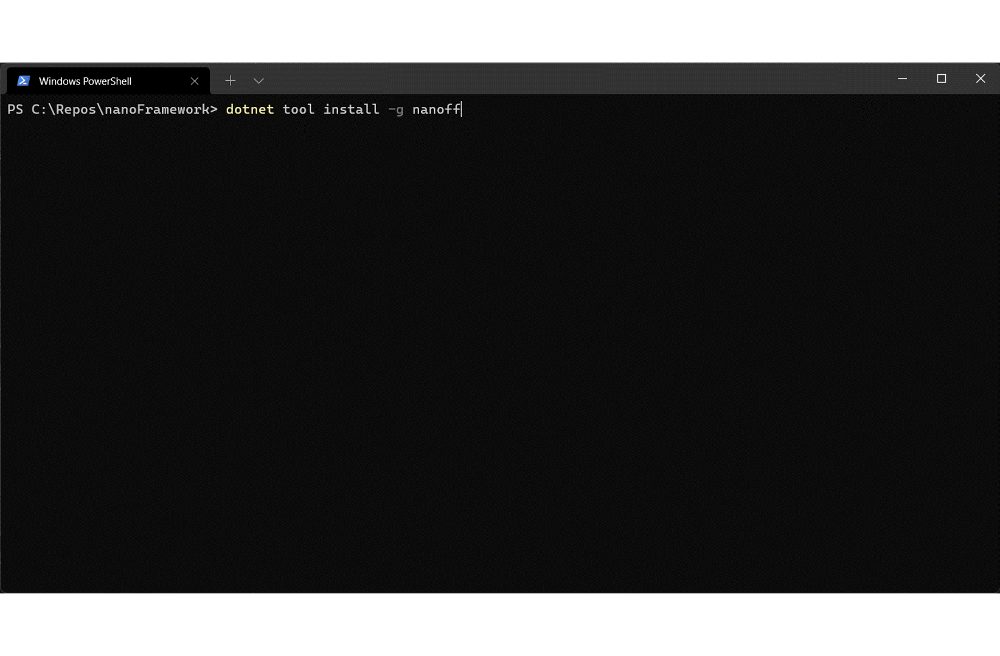
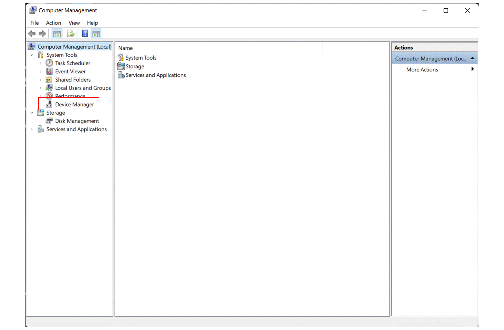

[](https://github.com/nanoframework/Home/blob/main/CONTRIBUTING.md) [](https://dev.azure.com/nanoframework/nanoFirmwareFlasher/_build/latest?definitionId=45&repoName=nanoframework%2FnanoFirmwareFlasher&branchName=main) [](https://www.nuget.org/packages/nanoff/) [](https://discord.gg/gCyBu8T)


-----
Document Language: [English](README.md) | [中文简体](README.zh-cn.md)

# Welcome to the .NET **nanoFramework** firmware flasher tool repository

This repo contains the **nano** **f**irmware **f**lasher tool.
It's a [.NET Core Tool](https://docs.microsoft.com/en-us/dotnet/core/tools/global-tools) that allows flashing a .NET **nanoFramework** target with a firmware image (nanoBooter and nanoCLR), the application deployment (all assemblies required to run a .NET application) and restore previously saved deployment images.
Is part of .NET **nanoFramework** toolbox, along with other various tools that are required in .NET **nanoFramework** development, usage or repository management.

It makes use of a couple of 3rd party tools for some platforms:

- Texas Instruments Uniflash (TI CC13x2/CC26x2)
   You can find the [Uniflash tool download and licensing information](http://www.ti.com/tool/download/UNIFLASH).
- SEGGER J-Link (Silabs Giant Gecko)
   You can find the [J-Link download, licensing information and documentation](https://www.segger.com/downloads/jlink/).

We are also distributing this tool as a .NET library so it can be integrated in 3rd party applications. Please check the [README](Samples/README.md) in the Samples folder for more details along with sample applications.

> [!Note]: we are implementing the Espressif and STM32 communication protocols in C# and we are not using `esptool` or the STM32 Cube Programmer CLI to flash devices anymore. ESP32 stopped using `esptool` before April 2026; STM32 stopped requiring the STM32 Cube Programmer CLI tool at the same time — DFU, JTAG and SWD connections are now all native, with no external tool or driver-signing prompts required for flashing.

## Install .NET **nanoFramework** Firmware Flasher

Perform a one-time install of the .NET **nanoFramework** Firmware Flasher tool using the following .NET Core CLI command:

```console
dotnet tool install -g nanoff
```

After a successful installation a message is displayed showing the command that's to be used to call the tool along with the version installed. Similar to the following example:

```console
You can invoke the tool using the following command: nanoff
Tool 'nanoff' (version '9.9.9') was successfully installed.
```



### MacOS users

You'll need to add `nanoff` to your path as well, once installed run:

```console
export PATH=$PATH:~/.dotnet/tools
```

## Update .NET **nanoFramework** Firmware Flasher

To update .NET **nanoFramework** Firmware Flasher tool use the following .NET Core CLI command:

```console
dotnet tool update -g nanoff
```

If the tool was installed at a specific path, use the following .NET Core CLI command instead:

```console
dotnet tool update nanoff --tool-path c:\path-where-the-tool-was-installed
```

## Usage

Once the tool is installed, you can call it by using its command `nanoff`, which is a short version of the name to ease typing.

```console
nanoff [command] [args]
```

The tool includes help for all available commands. You can see a list of all available ones by entering:

```console
nanoff --help
```

`nanoff` uses **verbs** followed by **keyword/value pairs** — no `--` dashes:

```console
nanoff <verb> [<keyword> [<value>]]* [<flag>]*
```

For example:

```console
nanoff flash target ESP32_PSRAM_REV0 serialport COM31
```

- Each verb has its own set of keywords. A keyword either takes the next token as its value (`target ESP32_PSRAM_REV0`) or is a standalone flag with no value (`masserase`).
- Except for the verb itself (which must always be bare, e.g. `flash`, not `--flash`), keywords can be written with or without the `--` prefix: `flash --target ESP32_PSRAM_REV0 --serialport COM31` works exactly like the bare form above.
- `nanoff help` and `nanoff <verb> help` (as well as the usual `nanoff --help`/`nanoff <verb> --help`) print the full, authoritative list of keywords for that verb — use them if anything below looks out of date.
- `nanoff version`/`nanoff --version` prints the installed version.

> [!NOTE]
> Each command performs **one verb's operation**. Combining a firmware update and a managed application deploy now takes two separate commands (`flash` then `deploy`) instead of one — this replaces the older single-command `--update --deploy` form.
>
> `nanoff` runs on Windows, Linux and macOS. Examples below mostly use Windows-style serial ports (`COM31`) and paths (`c:\...`) for brevity, but the same commands work identically on Linux/macOS with:
>
> - Serial ports like `/dev/ttyUSB0`, `/dev/ttyACM0` (Linux) or `/dev/cu.usbserial-1420` (macOS) instead of `COMx`. Use `nanoff list ports` to see what's available on your machine — see [Finding the device COM port using nanoff](#finding-the-device-com-port-using-nanoff).
> - Forward-slash paths, e.g. `/home/user/nf-interpreter/build/nanoCLR.bin` or `~/backups/esp32.bin`, instead of `c:\...`.
>
> A couple of examples further down show both forms side by side as a reminder.

List of verbs:

| Verb | Purpose |
| --- | --- |
| [`flash`](#flash) | Flash firmware (from the online repository, a firmware archive, or local HEX/BIN files) onto a target device. |
| [`deploy`](#deploy) | Deploy a managed application image, or a file/network deployment package, to a device already running nanoFramework. |
| [`list`](#list) | List targets, connected nanoFramework devices, COM ports, or connected programming interfaces. |
| [`details`](#details) | Read details from a connected device. |
| [`identify`](#identify) | Show which firmware target `nanoff` would use for a device, without flashing or deploying anything. |
| [`drivers`](#drivers) | Show/install drivers required by a given flashing interface. |
| [`cache`](#cache) | Clear the local firmware cache, or download firmware into a local firmware archive. |
| [`keys`](#keys) | Generate an MCUboot signing key, or export its public key. |

Jump to a verb's examples, grouped by device type:

- `flash`: [ESP32](#flash--esp32) | [STM32](#flash--stm32) | [TI CC13x2](#flash--ti-cc13x2) | [Silabs Giant Gecko](#flash--silabs-giant-gecko) | [Raspberry Pi Pico](#flash--raspberry-pi-pico) | [Generic nanoDevice](#flash--generic-nanodevice-plain-connection) | [MCUboot (SMP)](#flash--mcuboot-smp)
- `deploy`: [ESP32](#deploy--esp32) | [STM32](#deploy--stm32) | [Silabs Giant Gecko](#deploy--silabs-giant-gecko) | [Raspberry Pi Pico](#deploy--raspberry-pi-pico) | [Generic nanoDevice](#deploy--generic-nanodevice-plain-connection) | [MCUboot (SMP)](#deploy--mcuboot-smp) | [File deployment](#deploy--file-deployment) | [Network deployment](#deploy--network-deployment)
- [`list`](#list)
- `details`: [ESP32](#details--esp32) | [Raspberry Pi Pico](#details--raspberry-pi-pico) | [Generic nanoDevice](#details--generic-nanodevice)
- [`identify`](#identify)
- `drivers`: [STM32 DFU](#drivers--stm32-dfu) | [STM32 JTAG](#drivers--stm32-jtag) | [TI XDS110](#drivers--ti-xds110)
- `cache`: [clear](#cache--clear) | [download](#cache--download)
- `keys`: [generate](#keys--generate) | [getpub](#keys--getpub)
- [Common keywords](#common-keywords)

You will also need to know the COM port used by your device for most operations. Find [how to do this here](#finding-the-device-com-port-on-windows), or use `nanoff list ports` — see [Finding the device COM port using nanoff](#finding-the-device-com-port-using-nanoff).

## `flash`

Flash firmware onto a target device — from the online repository (`target`/`platform` + `fwversion`/`preview`), from a local firmware archive (`fromarchive archivepath <path>`), or by flashing a local image directly (`image`/`address`, or `image hex` for Intel HEX files).

Common keywords across all platforms: `target`, `platform`, `dfu`/`jtag`/`nativeswd` (STM32 only, force a specific interface — omit all three for auto-detect), `deviceid` (DFU/JTAG/SWD probe, or J-Link probe id for EFM32), `fwversion`, `preview`, `masserase`, `verify`, `reset`, `nofitcheck`, `serialport`, `image` (a local CLR/firmware file to use instead of downloading — see each platform's examples), `fromarchive`/`archivepath`.

There are multiple ESP32 images available, some are built specifically for a target. Please check out the [list](https://github.com/nanoframework/nf-interpreter#firmware-for-reference-boards).

### `flash` — ESP32

The ESP32_PSRAM_REV0 image will just work for any variant of the ESP32 series, with or without PSRAM, and for all silicon revisions.
You can read more about the differences between the various images in the [reference targets documentation](https://docs.nanoframework.net/content/reference-targets/esp32.html).

The ESP32_S2 image is the generic target for the ESP32-S2 series and covers all S2 variants. See the same [reference targets documentation](https://docs.nanoframework.net/content/reference-targets/esp32.html) for details.

When using `nanoff` you can add `target MY_TARGET_NAME_HERE` to use a specific image. If, instead, you just specify the platform with `platform esp32`, `nanoff` will choose the most appropriate image depending on the features of the device that's connected. Output similar to this one will show to advise what's the image about to be used:

```console
No target name was provided! Using 'ESP32_REV0' based on the device characteristics.
```

>Note: For ESP32-S3 targets, `nanoff` defaults to `ESP32_S3_OCTAL` (or `ESP32_S3_QUAD` for early silicon revisions) since it cannot detect the PSRAM type automatically. A warning is printed suggesting the alternative target if needed.

Some ESP32 boards have issues entering bootloader mode. This can be usually overcome by holding down the BOOT/FLASH button in the board.
In case `nanoff` detects this situation the following warning is shown:

```console
*** Hold down the BOOT/FLASH button in ESP32 board ***
```

> [!WARNING]
> To update FeatherS2, TinyS2 and some S3 modules, the board needs to be put in _download mode_ by holding [BOOT], clicking [RESET] and then releasing [BOOT].

#### Update the firmware of an ESP32 target

To update the firmware of an ESP32 target connected to COM31, to the latest available development version.

```console
nanoff flash target ESP32_PSRAM_REV0 serialport COM31 preview
```

On Linux or macOS, use the device path for your board instead of a COM port, e.g.:

```console
nanoff flash target ESP32_PSRAM_REV0 serialport /dev/ttyUSB0
```

#### Update the firmware of an ESP32-S2 with a local CLR file

To update the firmware of an ESP32-S2 target connected to COM31 with a local CLR file (for example from a build).
This file has to be a binary file with a valid CLR from a build. No other checks or validations are performed on the file content.

```console
nanoff flash target ESP32_S2 serialport COM31 image "C:\nf-interpreter\build\nanoCLR.bin"
```

On Linux/macOS:

```console
nanoff flash target ESP32_S2 serialport /dev/ttyUSB0 image ~/nf-interpreter/build/nanoCLR.bin
```

You can adjust the name of the core image you want to use. Refer to the previous section to get the full list.

#### Update firmware and deploy an application afterward (ESP32)

Updating the firmware and deploying a managed application used to be combinable in one command. That is now two commands: `flash` first, then [`deploy`](#deploy--esp32).

```console
nanoff flash target ESP32_PSRAM_REV0 serialport COM31
nanoff deploy target ESP32_PSRAM_REV0 serialport COM31 image "c:\esp32-backups\my_awesome_app.bin" address 0x1B000
```

#### Back up the entire flash before flashing (ESP32)

To back up the device's entire current flash contents to a file before flashing.

```console
nanoff flash target ESP32_PSRAM_REV0 serialport COM31 backup ./backups/esp32.bin
```

`backup` can also be used on its own, with no path, in which case a randomly named file is generated (in the current directory):

```console
nanoff flash target ESP32_PSRAM_REV0 serialport COM31 backup
```

Omitting `backup` entirely means no whole-flash backup is taken — this is the default.

#### Keep a copy of the configuration partition backup (ESP32)

The configuration partition is **always** automatically backed up before flashing and restored afterward — there is no way (nor need) to turn this off. Add `restore <path>` if you also want to keep a persistent copy of that backup:

```console
nanoff flash target ESP32_PSRAM_REV0 serialport COM31 restore ./backups/config.bin
```

`restore` can also be used bare, with no path — this is equivalent to omitting it: the backup is still taken and restored, just kept in a temporary file that's deleted once it's restored, rather than a path you specify.

### `flash` — STM32

STM32 flashing is fully native (DFU, JTAG/ST-LINK and CMSIS-DAP/SWD) — the STM32 Cube Programmer CLI tool is not required. On Windows, the connection still needs the appropriate WinUSB-class driver bound to the device (see [`drivers`](#drivers--stm32-dfu)); no driver installation is required on Linux or macOS. If you don't specify `dfu`, `jtag` or `nativeswd`, `nanoff` auto-detects the best available connection.

#### Update the firmware of a specific STM32 target

To update the firmware of the ST_STM32F769I_DISCOVERY target to the latest available stable version, auto-detecting the connection.

```console
nanoff flash target ST_STM32F769I_DISCOVERY
```

To force a specific interface (`dfu`, `jtag` for ST-LINK, or `nativeswd` for CMSIS-DAP probes) — only one of the three can be given:

```console
nanoff flash target ST_STM32F769I_DISCOVERY jtag
```

#### Flash a custom BIN file directly to an STM32 device

To flash a local BIN file (for example a managed application deployment image) directly to a connected STM32 device, without going through the online firmware repository. You have to specify the flash address (hexadecimal format).

```console
nanoff flash jtag image "c:\dev\my awesome app\bin\debug\my_awesome_app.bin" address 0x08000000
```

On Linux/macOS, quote the path the same way you would for any shell command with spaces in it:

```console
nanoff flash jtag image "/home/user/dev/my awesome app/bin/debug/my_awesome_app.bin" address 0x08000000
```

If the file is an Intel HEX file instead of raw binary, add `hex` — the address is embedded in the file, so `address` isn't needed:

```console
nanoff flash jtag image "c:\dev\my awesome app\bin\debug\my_awesome_app.hex" hex
```

#### List all STM32 devices available with JTAG/ST-LINK connection

```console
nanoff list jtag
```

#### List all STM32 devices available with DFU connection

```console
nanoff list dfu
```

#### List all STM32 CMSIS-DAP (native SWD) probes

```console
nanoff list nativeswd
```

### `flash` — TI CC13x2

#### Update the firmware of a specific TI CC13x2 target

To update the firmware of the TI_CC1352R1_LAUNCHXL target to the latest version.

```console
nanoff flash target TI_CC1352R1_LAUNCHXL
```

### `flash` — Silabs Giant Gecko

#### Update the firmware of a specific Silabs target

To update the firmware of the SL_STK3701A target to the latest version.

```console
nanoff flash target SL_STK3701A
```

#### Update the firmware of a Silabs target from a local file

To update the firmware of a Silabs target with a local firmware file (for example from a build).
This file has to be a binary file with a valid Booter and CLR from a build. No checks or validations are performed on the file(s) content.

```console
nanoff flash platform efm32 image "C:\nf-interpreter\build\nanobooter-nanoclr.bin" address 0x0
```

#### List all Silabs devices available with J-Link connection

```console
nanoff list jlink
```

### `flash` — Raspberry Pi Pico

Raspberry Pi Pico boards (RP2040 and RP2350) use UF2 mass storage for firmware deployment. The device must be in **BOOTSEL mode** — hold the BOOTSEL button while connecting the USB cable. The board will appear as a USB drive (labelled `RPI-RP2` or `RP2350`).

No external tools or drivers are required. `nanoff` handles UF2 conversion automatically.

If no device is detected, `nanoff` will wait up to 30 seconds for a Pico to enter BOOTSEL mode. During Pico firmware update and mass-erase operations, if multiple Pico devices are connected in BOOTSEL mode simultaneously, `nanoff` will use the first one found and display a warning.

#### Update the firmware of a Raspberry Pi Pico

To update the firmware of a Raspberry Pi Pico (RP2040) to the latest available stable version.

```console
nanoff flash target PICO_RP2040
```

#### Update the firmware of a Raspberry Pi Pico 2

To update the firmware of a Raspberry Pi Pico 2 (RP2350) to the latest available preview version.

```console
nanoff flash target PICO2_RP2350 preview
```

### `flash` — Generic nanoDevice (plain connection)

It's possible to update a nano device using the same connection that is used for Visual Studio connection, meaning that no specialized connection is required (like JTAG, or J-Link). This is only possible if the device has previously been flashed with a working nanoFramework firmware — no `target`/`platform` is given, just a `serialport`.

#### Update the CLR of a nano device

To update the CLR of a nano device connected to a serial port to the latest available version.
This will find the latest available firmware for the connected device and will update the CLR.

```console
nanoff flash serialport COM9
```

On Linux/macOS, use the device path instead, e.g. `/dev/ttyACM0` (Linux) or `/dev/cu.usbmodem14201` (macOS):

```console
nanoff flash serialport /dev/ttyACM0
```

#### Update the CLR of a nano device from a local file

To update the firmware of a nano device with a local firmware file (for example from a build).
This file has to be a binary file with a valid nanoCLR from a build. No checks or validations are performed on the file content.

```console
nanoff flash serialport COM9 image "C:\nf-interpreter\build\nanoclr.bin"
```

On Linux/macOS:

```console
nanoff flash serialport /dev/ttyACM0 image ~/nf-interpreter/build/nanoclr.bin
```

### `flash` — MCUboot (SMP)

[MCUboot](https://docs.mcuboot.com/) is an open-source secure bootloader that provides firmware update capabilities with image signing, rollback protection, and two image slots (primary + secondary). When a .NET nanoFramework target is running MCUboot, images are uploaded through the **SMP (Simple Management Protocol)** serial transport instead of the platform-specific flash protocol. Adding the `mcuboot` keyword switches `flash`, `deploy` and `list images` to MCUboot mode. `serialport` is always required.

nanoFramework MCUboot targets use a **two-image layout**, and the verb picks the image:

| MCUboot image | Content | Command |
| --- | --- | --- |
| **Image 0** | nanoCLR binary | `nanoff flash ... image <file> mcuboot` |
| **Image 1** | Managed deployment assemblies | `nanoff deploy ... image <file> mcuboot` (see [`deploy` — MCUboot (SMP)](#deploy--mcuboot-smp)) |

The device must be in MCUboot serial recovery (bootloader serial SMP enabled). The SMP baud rate is fixed at **115200 baud** — the standard MCUboot serial SMP default, which is different from the ESP32 flash baud rate (default 1,500,000). Use [`nanoff list devices`](#list-connected-nanoframework-devices) to find devices in MCUboot serial recovery.

#### Upload a pre-signed CLR image

```console
nanoff flash serialport COM31 image "C:\fw\nanoCLR-signed.bin" mcuboot
```

The image is written to the **primary** slot and the device boots it on the next reset — no test/confirm step is issued by `nanoff`. Whether the new image becomes permanent (and how rollback is handled) is managed by the running firmware through the MCUboot runtime interface.

#### Sign and upload a CLR image

When `signkey` is given, `nanoff` signs the image with `imgtool` before uploading it (see [`keys`](#keys) to create a signing key):

```console
nanoff flash serialport COM31 image nanoCLR.bin mcuboot signkey my-signing-key.pem
```

Signing requires `imgtool`, which is part of the MCUboot Python package. It must be available on your PATH or invocable as `python -m imgtool`; `nanoff` searches both automatically:

```console
pip install imgtool
```

Override the signing defaults when your MCUboot partition layout differs from the standard nanoFramework configuration. Values can be decimal or hexadecimal (`0x` prefix), and only apply together with `signkey`:

| Keyword | Default | Description |
| --- | --- | --- |
| `slotsize` | `0x100000` (1 MB) | Image slot size in bytes. Must match the slot size in the MCUboot partition table for the image being signed. |
| `headersize` | `0x200` (512 B) | MCUboot image header size. Must match the MCUboot build configuration. |
| `writealign` | `4` | Flash write alignment in bytes. Typically 4 for most MCU flash. |

```console
nanoff flash serialport COM31 image nanoCLR.bin mcuboot signkey my-signing-key.pem slotsize 0xE8000
```

#### Upload to the secondary slot (development only)

> ⚠️ **Development/staging use only.** By default the image is written to the **primary** slot, which is what regular updates should use. Adding `secondaryslot` writes it to the **secondary** slot instead and marks it as pending (test), so MCUboot swaps it in on the next reset. The image must be signed. The swap is never confirmed by `nanoff`: confirming it is up to the running firmware, otherwise MCUboot reverts to the previous image.

```console
nanoff flash serialport COM31 image "C:\fw\nanoCLR-signed.bin" mcuboot secondaryslot
```

#### First-time provisioning of an ESP32

The first time you provision an ESP32 device with MCUboot, the MCUboot firmware package (bootloader, partition table and nanoCLR image) is downloaded and flashed via the standard ESP32 serial bootloader. This happens automatically when a `target` is given with `mcuboot` and the device does not yet have MCUboot running. If MCUboot is already running, the CLR image given with `image` is uploaded via SMP instead.

```console
nanoff flash target ESP32_GENERIC serialport COM31 mcuboot
```

| Device | Command | Update path used |
| --- | --- | --- |
| ESP32, no MCUboot | `flash target ... mcuboot` | First-time provisioning via the ESP32 serial bootloader |
| ESP32, MCUboot running | `flash ... image <file> mcuboot` | SMP serial transport |
| Any other target running MCUboot | `flash ... image <file> mcuboot` | SMP serial transport |

## `deploy`

Deploy an application image, or a file/network deployment package, to a device that is already running nanoFramework. Exactly one of `image`, `file` or `network` must be given.

### `deploy` — ESP32

To deploy a managed application to an ESP32_PSRAM_REV0 target connected to COM31.

>Note: The binary file with the deployment image can be found on the Release or Debug folder of a Visual Studio project after a successful build. This file contains everything that's required to deploy a managed application to a target (meaning application executable and all referenced libraries and assemblies).

```console
nanoff deploy target ESP32_PSRAM_REV0 serialport COM12 image "E:\GitHub\nf-Samples\samples\Blinky\Blinky\bin\Debug\Blinky.bin"
```

On Linux/macOS:

```console
nanoff deploy target ESP32_PSRAM_REV0 serialport /dev/ttyUSB0 image ~/nf-Samples/samples/Blinky/Blinky/bin/Debug/Blinky.bin
```

Optionally, `address` can be added to override the default deployment partition address (hexadecimal format):

```console
nanoff deploy target ESP32_PSRAM_REV0 serialport COM31 image "c:\esp32-backups\my_awesome_app.bin" address 0x1B000
```

### `deploy` — STM32

To deploy a managed application to a ST_STM32F769I_DISCOVERY target, which has the deployment region at 0x08080000 flash address, and reset the MCU after flashing it. `address` is **required** for STM32 targets.

>Note: The binary file with the deployment image can be found on the Release or Debug folder of a Visual Studio project after a successful build. This file contains everything that's required to deploy a managed application to a target (meaning application executable and all referenced libraries and assemblies).

```console
nanoff deploy target ST_STM32F769I_DISCOVERY image "E:\GitHub\nf-Samples\samples\Blinky\Blinky\bin\Debug\Blinky.bin" address 0x08080000
```

### `deploy` — Silabs Giant Gecko

To deploy a managed application to a SL_STK3701A target, which has the deployment region at 0x000EE000 flash address.

```console
nanoff deploy target SL_STK3701A image "E:\GitHub\nf-Samples\samples\Blinky\Blinky\bin\Debug\Blinky.bin" address 0x000EE000
```

### `deploy` — Raspberry Pi Pico

Raspberry Pi Pico deployment uses the wire protocol by default; add `uf2deploy` on the corresponding `flash` command instead if you want to deploy through UF2 mass storage while the device is in BOOTSEL mode.

```console
nanoff deploy target PICO_RP2040 serialport COM9 image "c:\dev\my awesome app\bin\debug\my_awesome_app.bin"
```

### `deploy` — Generic nanoDevice (plain connection)

To deploy (or update) a managed application, the path to the managed application has to be provided.
This example uses the binary format file that is generated by Visual Studio when building any nanoFramework C# application. Because it's possible to retrieve all the required details from the connected device no other configuration is required.

```console
nanoff deploy serialport COM9 image "c:\dev\my awesome app\bin\debug\my_awesome_app.bin"
```

### `deploy` — MCUboot (SMP)

On a target running MCUboot, the deployment image is uploaded via SMP to **MCUboot Image 1** (see [`flash` — MCUboot (SMP)](#flash--mcuboot-smp) for the image layout and requirements). `serialport` and `image` are required; `address`, `file` and `network` don't apply.

```console
nanoff deploy serialport COM31 image "C:\fw\deployment-signed.bin" mcuboot
```

The same signing keywords as `flash` are available (`signkey`, `slotsize`, `headersize`, `writealign`), as well as `secondaryslot`:

```console
nanoff deploy serialport COM31 image deployment.bin mcuboot signkey my-signing-key.pem slotsize 0x100000
```

### `deploy` — File deployment

Some devices like ESP32, Orgpal and few others have storage available. Files can be deployed to this storage. You have to use the `file` keyword pointing to a JSON file to deploy files:

```console
nanoff deploy file C:\path\deploy.json
```

>Note: This used to be combinable with a firmware update (`--update --masserase --filedeployment ...`) in a single command. Flash the firmware first, then deploy the files as a second command:
>
> ```console
> nanoff flash target ESP32_C3 masserase serialport COM21
> nanoff deploy file C:\path\deploy.json serialport COM21
> ```

The JSON has an optional `SerialPort` field in case the port to upload the files differs from the one specified on the command line, and a **mandatory** list of `Files` entries. Each entry must contain `DestinationFilePath`, the destination full path file name and `SourceFilePath` to deploy content, otherwise to delete the file, the full path with file name of the source file to be deployed:

```json
{
   "serialport":"COM42",
   "files": [
      {         
         "DestinationFilePath": "I:\\TestFile.txt",
         "SourceFilePath": "C:\\tmp\\NFApp3\\NFApp3\\TestFile.txt"
      },
      {
         "DestinationFilePath": "I:\\NoneFile.txt"
      },
      {
         "DestinationFilePath": "I:\\willnotexist.txt",
         "SourceFilePath": "C:\\WRONGPATH\\TestFile.txt"
      }
   ]
}
```

> [!Note]
> If a file already exists in the storage, it will be replaced by the new one.
>
> If a file does not exist and is requested to be deleted, nothing will happen, a warning will be displayed.
>
> If a file can't be uploaded because of a problem, the deployment of the other files will continue and an error will be displayed.

### `deploy` — Network deployment

You can upload Wireless, Wireless Access Point, Ethernet configurations and Certificates during a deploy operation so that your device is ready to go and those elements do not need to be stored in the code or beforehand in the internal storage. Depending on your device, some options may not be available, so check out what is available on your device before trying to upload them.

```console
nanoff deploy network C:\path\deploy.json
```

The JSON file can contain various optional configurations:

```json
{
   "serialport":"COM42",
   "WirelessClient": { },
   "WirelessAccessPoint": { },
   "Ethernet": { },
   // Only one or the other can be used
   "DeviceCertificates": "base64",
   "DeviceCertificatesPath": "c:\\path_to\\cert.pem",
   // Only one or the other can be used
   "CACertificates": "base64",
   "CACertificatesPath": "c:\\path_to\\certca.pem"
}
```

The optional `SerialPort` can be used in case the port to upload the configurations is different from the one specified on the command line.

Here is a minimal example setting up a Wireless Client and a Wireless Access Point configuration at the same time:

```json
{"SerialPort":"COM10","WirelessClient":{"SSID":"MySSID","Password":"the_secret_password"},"WirelessAccessPoint":{"SSID":"nanoDevice","Password":null,"IPv4Address":"192.168.10.1","IPv4NetMask":"255.255.255.0","Authentication":"None"}}
```

See the section further to understand what are the mandatory fields and which ones are optional.

#### Wireless Client options

The `WirelessClient` object represents the wireless configuration settings for a network deployment. It contains the following properties:

- **Ssid**:
  - Type: `string`
  - Format: 32 characters maximum.
  - Mandatory

- **Password**:
  - Type: `string`
  - Format: 64 characters maximum
  - Default: empty string meaning no password.
  - Optional

- **Authentication**
  - Type: `string`
  - Possible values (case insensitive): `EAP, PEAP, WCN, OPEN, SHARED, WEP, WPA, WPA2, NONE`
  - Description: the authentication type.
  - Default: if nothing is specified, the internal value is not going to be changed

- **Encryption**
  - Type `string`
  - Possible values (case insensitive): `WEP, WPA, WPA2, WPA_PSK, WPA2_PSK2, Certificate, None`
  - Description: the encryption type.
  - Default: if nothing is specified, the internal value is not going to be changed

- **ConfigurationOption**
  - Type: `string`
  - Possible values (case insensitive): `None, Disable, Enable, AutoConnect, SmartConfig`
  - Description: the configuration option.
  - Default: if nothing is specified, the internal value is not going to be changed

- **RadioType**
  - Type: `string`
  - Possible values (case insensitive): `802.11a, 802.11b, 802.11g, 802.11n`
  - Description: the radio type.
  - Default: if nothing is specified, the internal value is not going to be changed

- **DhcpEnabled**
  - Type: `bool`
  - Default: true
  - Optional
  - Description: a value indicating whether DHCP is enabled. If set to `false`, the `IPv4Address` and `IPv4NetMask` need to be set up.

- **AutomaticDNS**
  - Type: `bool`
  - Default: true
  - Optional
  - Description: a value indicating whether automatic DNS is enabled. If set to `false`, `Ipv4DNSAddress1` needs at least to be set.

- **IPv4Address**
  - Type: `string`
  - Format: `1.2.3.4` where 1, 2, 3 and 4 are bytes with values from 0 to 255.
  - Description: the IPv4 address. This needs to be set if `DhcpEnabled` is `false`.

- **IPv4NetMask**
  - Type: `string`
  - Format: `1.2.3.4` where 1, 2, 3 and 4 are bytes with values from 0 to 255.
  - Description: the IPv4 netmask. This needs to be set if `DhcpEnabled` is `false`.

- **IPv4Gateway**
  - Type: `string`
  - Format: `1.2.3.4` where 1, 2, 3 and 4 are bytes with values from 0 to 255.
  - Description: the IPv4 gateway.

- **IPv4DNSAddress1**
  - Type: `string`
  - Format: `1.2.3.4` where 1, 2, 3 and 4 are bytes with values from 0 to 255.
  - Description: the primary IPv4 DNS address.

- **IPv4DNSAddress2**
  - Type: `string`
  - Format: `1.2.3.4` where 1, 2, 3 and 4 are bytes with values from 0 to 255.
  - Description: the secondary IPv4 DNS address.

- **MacAddress**
  - Type: `string`
  - Format: `AABBCCDDEEFF` or `AA:BB:CC:DD:EE:FF`
  - Description: the MAC address.
  - Note: some devices do not allow this to be set, please check your device first.

#### Wireless Access Point options

- **Ssid**:
  - Type: `string`
  - Format: 32 characters maximum.
  - Mandatory

- **Password**:
  - Type: `string`
  - Format: 64 characters maximum
  - Default: empty string meaning no password.
  - Optional

- **Authentication**
  - Type: `string`
  - Possible values (case insensitive): `EAP, PEAP, WCN, OPEN, SHARED, WEP, WPA, WPA2, NONE`
  - Description: the authentication type.
  - Default: if nothing is specified, the internal value is not going to be changed

- **Encryption**
  - Type `string`
  - Possible values (case insensitive): `WEP, WPA, WPA2, WPA_PSK, WPA2_PSK2, Certificate, None`
  - Description: the encryption type.
  - Default: if nothing is specified, the internal value is not going to be changed

- **ConfigurationOption**
  - Type: `string`
  - Possible values (case insensitive): `None, Disable, Enable, AutoConnect, SmartConfig`
  - Description: the configuration option.
  - Default: if nothing is specified, the internal value is not going to be changed

- **RadioType**
  - Type: `string`
  - Possible values (case insensitive): `802.11a, 802.11b, 802.11g, 802.11n`
  - Description: the radio type.
  - Default: if nothing is specified, the internal value is not going to be changed

- **IPv4Address**
  - Type: `string`
  - Format: `1.2.3.4` where 1, 2, 3 and 4 are bytes with values from 0 to 255.
  - Description: the IPv4 address.
  - Mandatory.

- **IPv4NetMask**
  - Type: `string`
  - Format: `1.2.3.4` where 1, 2, 3 and 4 are bytes with values from 0 to 255.
  - Description: the IPv4 netmask.
  - Mandatory.

- **IPv4Gateway**
  - Type: `string`
  - Format: `1.2.3.4` where 1, 2, 3 and 4 are bytes with values from 0 to 255.
  - Description: the IPv4 gateway.
  - Default: the `IPv4Address` value

- **IPv4DNSAddress1**
  - Type: `string`
  - Format: `1.2.3.4` where 1, 2, 3 and 4 are bytes with values from 0 to 255.
  - Description: the primary IPv4 DNS address.

- **IPv4DNSAddress2**
  - Type: `string`
  - Format: `1.2.3.4` where 1, 2, 3 and 4 are bytes with values from 0 to 255.
  - Description: the secondary IPv4 DNS address.

- **MacAddress**
  - Type: `string`
  - Format: `AABBCCDDEEFF` or `AA:BB:CC:DD:EE:FF`
  - Description: the MAC address.
  - Note: some devices do not allow this to be set, please check your device first.

#### Ethernet options

Represents an Ethernet configuration and here are the properties:

- **DhcpEnabled**
  - Type: `bool`
  - Default: true
  - Optional
  - Description: a value indicating whether DHCP is enabled. If set to `false`, the `IPv4Address` and `IPv4NetMask` need to be set up.

- **AutomaticDNS**
  - Type: `bool`
  - Default: true
  - Optional
  - Description: a value indicating whether automatic DNS is enabled. If set to `false`, `Ipv4DNSAddress1` needs at least to be set.

- **IPv4Address**
  - Type: `string`
  - Format: `1.2.3.4` where 1, 2, 3 and 4 are bytes with values from 0 to 255.
  - Description: the IPv4 address. This needs to be set if `DhcpEnabled` is `false`.

- **IPv4NetMask**
  - Type: `string`
  - Format: `1.2.3.4` where 1, 2, 3 and 4 are bytes with values from 0 to 255.
  - Description: the IPv4 netmask. This needs to be set if `DhcpEnabled` is `false`.

- **IPv4Gateway**
  - Type: `string`
  - Format: `1.2.3.4` where 1, 2, 3 and 4 are bytes with values from 0 to 255.
  - Description: the IPv4 gateway.

- **IPv4DNSAddress1**
  - Type: `string`
  - Format: `1.2.3.4` where 1, 2, 3 and 4 are bytes with values from 0 to 255.
  - Description: the primary IPv4 DNS address.

- **IPv4DNSAddress2**
  - Type: `string`
  - Format: `1.2.3.4` where 1, 2, 3 and 4 are bytes with values from 0 to 255.
  - Description: the secondary IPv4 DNS address.

- **MacAddress**
  - Type: `string`
  - Format: `AABBCCDDEEFF` or `AA:BB:CC:DD:EE:FF`
  - Description: the MAC address.
  - Note: some devices do not allow this to be set, please check your device first.

#### Device and CA Certificates

You can either **base64** encode your certificates (`DeviceCertificates` and `CACertificates`) or provide a path to a certificate file (`DeviceCertificatesPath` and `CACertificatesPath`). Note that the certificate file can contain multiple certificates one after the other. This is especially useful for CA certificates.

## `list`

List targets, connected nanoFramework devices, COM ports, connected programming interfaces, or the images in the MCUboot slots. Exactly one of `targets`, `devices`, `ports`, `dfu`, `jtag`, `jlink`, `nativeswd` or `images` must be given.

### List available COM ports

This method works on all operating systems. If you list them first without the device to flash and then plug the device, the additional port which shows up is the one for the device to flash.

```console
nanoff list ports
```

On Windows this lists names like `COM12`; on Linux it lists device paths like `/dev/ttyUSB0`/`/dev/ttyACM0`; on macOS it lists paths like `/dev/cu.usbserial-1420`.

### List connected nanoFramework devices

To get a list of connected nano devices, with the nanoCLR (or nanoBooter) version each one is running. If more details are required add the `verbosity` keyword set above normal.

```console
nanoff list devices
```

```console
nanoff list devices verbosity d
```

Output example:

```text
-- nanoCLR / nanoBooter --
SKY_EEVB_Debug @ COM7
  nanoCLR:     1.8.1.124

```

Output example with detailed verbosity:

```text
-- nanoCLR / nanoBooter --
SKY_EEVB_Debug @ COM7
  nanoCLR:     1.8.1.124
  Platform:    GGECKO_S1
  Date:        May 31 2023
  Type:        MinSizeRel build with Azure RTOS v6.2.0

```

#### Devices in MCUboot serial recovery

`list devices` also finds devices sitting in MCUboot serial recovery mode (recovery button held at reset, or no valid image). These don't answer the Wire Protocol, so every COM port is first probed with a short SMP (mcumgr) request; ports that answer are then left out of the Wire Protocol scan. Responsive devices are listed in a separate section with the target name, the MCUboot and nanoMCUboot versions and the image versions reported by the bootloader (older bootloaders only report the images). Add `serialport` to probe a single port.

```console
nanoff list devices serialport COM9
```

```text
-- MCUboot serial recovery --
ORGPAL_PALTHREE @ COM9
  MCUboot:     2.5.0-rc1
  nanoMCUboot: 1.0.2.2
  Image 0 slot 0: 1.8.1.124  active confirmed bootable
  Image 1 slot 0: 1.0.0.0  active confirmed bootable

```

With `verbosity d` the image hashes are shown too.

### List the images in the MCUboot slots

To list the images in the MCUboot primary and secondary slots of a device running MCUboot, via SMP. `mcuboot` and `serialport` are required.

```console
nanoff list images mcuboot serialport COM31
```

Output example:

```text
Image 0 Slot 0  version=1.2.3.4  hash=abcd1234...  [active, confirmed, bootable]
Image 0 Slot 1  version=1.3.0.0  hash=ef567890...  [pending, bootable]
```

### List available targets

You can list the supported targets, and their versions, using the `platform` keyword.

List packages available for ESP32 targets:

```console
nanoff list targets platform esp32
```

List packages available for STM32 targets:

```console
nanoff list targets platform stm32
```

If you use `list targets` together with `preview`, you'll get the list of available firmware packages that include experimental or major feature changes.

### List connected STM32 devices

STM32 device listing is fully native — no external tools required.

```console
nanoff list dfu
nanoff list jtag
nanoff list nativeswd
```

### List connected Silabs J-Link devices

```console
nanoff list jlink
```

## `details`

Read details from a connected device.

### `details` — ESP32

To show the details of the ESP32 device connected to COM31.

```console
nanoff details platform esp32 serialport COM31
```

Optionally add `checkpsram` to force the detection of PSRAM availability.

```console
nanoff details platform esp32 serialport COM31 checkpsram
```

### `details` — Raspberry Pi Pico

To show the details of the Pico device in BOOTSEL mode (chip type, board ID, bootloader version).

```console
nanoff details platform rpi_pico
```

### `details` — Generic nanoDevice

To get the details of a nano device connected to a serial port.

```console
nanoff details serialport COM9
```

## `identify`

Show which firmware target `nanoff` would use for a connected device, without flashing or deploying anything.

```console
nanoff identify platform esp32 serialport COM31
```

## `drivers`

Show driver install instructions for a flashing interface. Exactly one of `dfu`, `jtag` or `xds` must be given.

### `drivers` — STM32 DFU

To print instructions to install the STM32 DFU (WinUSB) driver.

```console
nanoff drivers dfu
```

### `drivers` — STM32 JTAG

To print instructions to install the STM32 JTAG/ST-LINK driver.

```console
nanoff drivers jtag
```

### `drivers` — TI XDS110

To install the XDS110 USB drivers required by TI LaunchPad targets.

```console
nanoff drivers xds
```

## `cache`

### `cache` — clear

If needed one can clear the local cache of firmware packages that are stored there.
As additional information, the cache location is the directory `.nanoFramework\fw_cache` in the user folder on Windows, or `~/.nanoFramework/fw_cache` on Linux and macOS.

```console
nanoff cache clear
```

### `cache` — download

By default, `nanoff` uses the online repository to look for firmware packages. It is also possible to use a local directory as the source of firmware. The firmware archive can be populated with `cache download`:

```console
nanoff cache download target ESP32_S3_OCTAL archivepath c:\...\firmware
nanoff cache download platform esp32 archivepath c:\...\firmware
```

For a list of archived firmware:

```console
nanoff list targets fromarchive archivepath c:\...\firmware
```

To flash firmware from the archive, use the same command line arguments as usual, but add `fromarchive` and `archivepath`:

```console
nanoff flash serialport COM9 fromarchive archivepath c:\...\firmware
```

## `keys`

Manage the ECDSA P-256 key pair used to sign MCUboot images (see [`flash` — MCUboot (SMP)](#flash--mcuboot-smp)). The public key must be compiled into the MCUboot bootloader; the private key is kept secure on the host. Requires `imgtool` (`pip install imgtool`). Exactly one of `generate` or `getpub` must be given.

### `keys` — generate

Generate a new signing key:

```console
nanoff keys generate my-signing-key.pem
```

### `keys` — getpub

Extract the public key from a signing key as a C source file:

```console
nanoff keys getpub root-pub-key.c signkey my-signing-key.pem
```

Include the generated `root-pub-key.c` in your MCUboot bootloader build.

## Common keywords

### Pre-check if target fits connected device

The tool tries to make a best effort sanity check on whether the requested target fits the connected target.
Sometimes that's not possible because of the differences and variations on the target names, or lack of details provided by the connected device or even (like with DFU connected devices) because it's not possible to determine exactly what device is connected at all.
This doesn't necessarily mean that the firmware won't work so should be taken as advice only.

To disable this validation add the `nofitcheck` keyword to the `flash` command line.

### Tool output verbosity

The tool output verbosity can be set through the  `v|verbosity` option.

This is convenient, for example, if this tool is being used in a automated process where the minimum output is desired to ease processing the return result of the execution. It can be set to:

- q[uiet]
- m[inimal]
- n[ormal]
- d[etailed]
- diag[nostic]

```console
nanoff flash target ESP32_PSRAM_REV0 serialport COM31 verbosity q
```

## Finding the device COM port on Windows

You need to know the COM Port attached to your device. Search for **Computer Management**, select **Device Manager** then expand **Ports (COM & LPT)**, you will find the COM port of the connected device.

> IMPORTANT: you may have to install drivers. Refer to the vendor website or use Windows Update to install the latest version of the drivers.



## Finding the device port on Linux/macOS

On Linux, plug in your device and run `ls /dev/tty*` (or `dmesg | tail` right after plugging it in) — look for a new `/dev/ttyUSB*` or `/dev/ttyACM*` entry. You may need to add your user to the `dialout` group to access it without `sudo`.

On macOS, plug in your device and run `ls /dev/cu.*` — look for a new `/dev/cu.usbserial-*` or `/dev/cu.usbmodem*` entry. Use the `cu.*` device, not the matching `tty.*` one, when passing it to `serialport`.

`nanoff list ports` (see next section) works identically on both and is the easiest cross-platform way to find it.

## Finding the device COM port using nanoff

You can use `nanoff list ports` to list the available COM ports. This method works on all operating systems. If you run the command first without your device plugged, you'll get a first list. Then plug your device and run the command again. The new COM port showing up is the one from your device!

```console
nanoff list ports
```

Example of outcomes when there is no device plugged in:

```text
No available COM port
```

And when you then plug the device and run the command again (Windows):

```text
Available COM ports:
  COM12
```

On Linux/macOS the same command lists device paths instead:

```text
Available COM ports:
  /dev/ttyUSB0
```

## Bypass version check

By default `nanoff` checks whether a new version of the tool has been published. If that is not necessary, the `suppressnanoffversioncheck` keyword can be added to any command to suppress the check.

## Exit codes

The exit codes can be checked in [this source file](https://github.com/nanoframework/nanoFirmwareFlasher/blob/main/nanoFirmwareFlasher.Library/ExitCodes.cs).

## Telemetry

`nanoff` collects anonymous usage telemetry. It helps us understand which commands, options and firmware packages are actually used, and which errors occur, so that we can focus on what matters. A short notice is shown the first time `nanoff` runs (once per major version).

### Opting out

Set either of these environment variables to `1` (or `true`):

- `NANOFRAMEWORK_TELEMETRY_OPTOUT`
- `DO_NOT_TRACK`

When opted out, no telemetry is collected or sent.

### What is collected

| Data | Details |
|---|---|
| Command | The verb (e.g. `flash`, `list`), the **names** of the keywords used, the effective platform, the exit code and the duration. Keyword **values** are only recorded for `platform`, `target`, `fwversion`, `verbosity`, `baud`, `flashmode`, `flashfreq`, `partitiontablesize` and `vcpbaud`. For commands that can't be parsed, the names of unknown keywords. |
| Firmware downloads | Package (target) name and version. |
| Errors | Exception type, innermost exception type, HRESULT and stack trace (with user profile paths, user name and machine name removed), plus where in `nanoff` the error occurred. |
| Environment | `nanoff` version, OS family and architecture, .NET runtime, whether running in a CI system, and an anonymous install ID: a random GUID stored in `~/.nanoFramework/telemetry.id`. |

### What is never collected

- Values of any other keyword: file paths, image file names, serial ports, device/probe IDs, flash addresses, deployment files.
- Exception messages.
- Device serial numbers, MAC addresses, user names or machine names.

Telemetry is sent to Azure Monitor (Application Insights) using OpenTelemetry. By default, Application Insights derives an approximate location (country/city) from the IP address and doesn't store the IP address itself. `nanoff` doesn't send the IP address as part of its telemetry data. Telemetry that can't be sent is kept in `~/.nanoFramework/telemetry` and retried on a later run.

### Library

The `nanoFramework.Tools.FirmwareFlasher` library doesn't send any telemetry. It emits its events (firmware downloads and errors) through `ILogger`, with the category `nanoFramework.Tools.FirmwareFlasher`, only when the host application sets `NanoTelemetry.LoggerFactory`. The former `NanoTelemetryClient` class has been removed.

## Feedback and documentation

To provide feedback, report issues and finding out how to contribute please refer to the [Home repo](https://github.com/nanoframework/Home).

Join our Discord community [here](https://discord.gg/gCyBu8T).

## Credits

The list of contributors to this project can be found at [CONTRIBUTORS](https://github.com/nanoframework/Home/blob/main/CONTRIBUTORS.md).

## License

The **nanoFramework** firmware flasher tool is licensed under the [MIT license](LICENSE).

## Code of Conduct

This project has adopted the code of conduct defined by the Contributor Covenant to clarify expected behaviour in our community.
For more information see the [.NET Foundation Code of Conduct](https://dotnetfoundation.org/code-of-conduct).

### _NET Foundation_

This project is supported by the [_NET Foundation_](https://dotnetfoundation.org).
